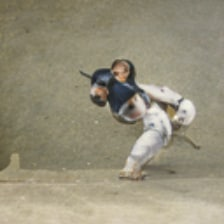
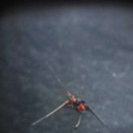
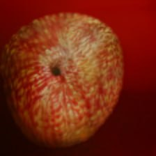

# StyleGANXL+CLIP notebook

A notebook for Out-of-Domain text-based image generation using the new StyleGAN-XL[^1] and CLIP[^2]. Now with W+ optimization (thanks to [Katherine Crowson](https://github.com/crowsonkb)) and video generation.

### Examples

|  |  |  |
| ----------- | ----------- | ----------- |
| **Two judo athletes fighting** | **An ant** | **A red apple** |

### Acknowledgements

The notebook is largely based on code by [Katherine Crowson](https://github.com/crowsonkb) and [nshepperd](https://github.com/nshepperd).

We are also very grateful for the help of the [CasualGANPapers](https://github.com/CasualGANPapers) community and especially [Axel Sauer](https://github.com/xl-sr) for taking it's time to help us and answer our questions.

[^1]: StyleGANXL was created by Axel Sauer and Katja Schwarz and Andreas Geiger. [Here](https://github.com/autonomousvision/stylegan_xl) is the official implementation.

[^2]: CLIP (Contrastive Language-Image Pre-Training) is a multimodal model made by OpenAI. For more information head over [here](https://github.com/openai/CLIP).
y
